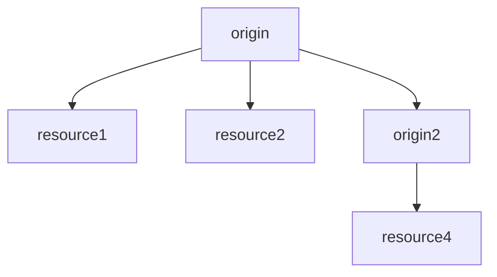
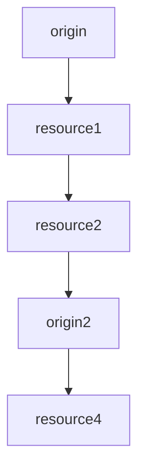

# Trace ID を graph 表示する
今は JSON のレコードを時刻並び替えして前後で遷移判定してしまっているので、
1 origin を読み込んだ後複数のリソースを読む場合には正しく表示できない。

時刻じゃなくて、step数みたいなものか、referer が必要かもしれない。
でも SPA とかだと正直どうしようもないかもしれない。

Origin ヘッダーの参照でいけるか？

例(理想)

例(よくない)

